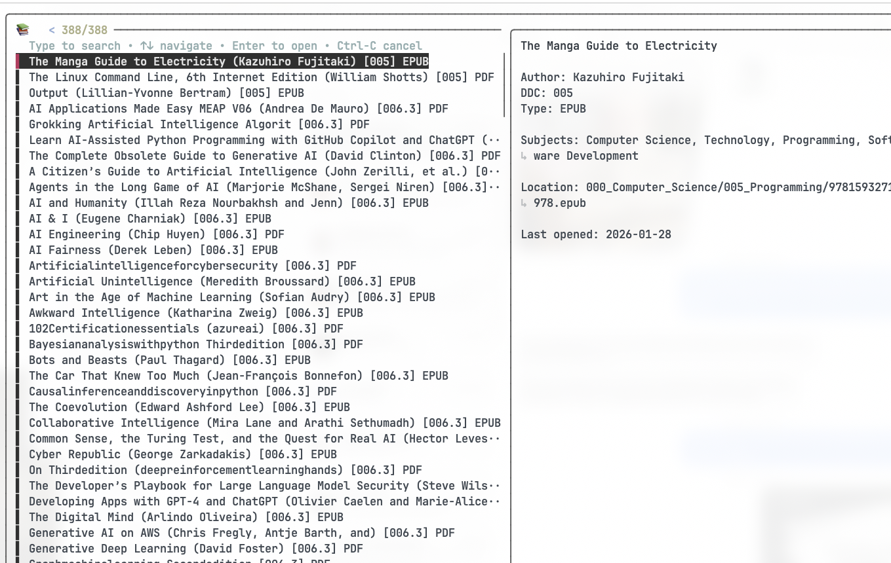

# Digital Library Manager (DLM)

An open-source, command-line toolset for managing, reading, and annotating a personal digital library using the **Dewey Decimal Classification (DDC)** system.

Now featuring an **AI Reading Assistant** that answers questions about the page you are reading in real-time.



## 🚀 Features

*   **System-Wide CLI:** Type `dlm` from anywhere to fuzzy-search your library.
*   **AI Reading Assistant:** Ask "What does this mean?" about your current page (powered by Google Gemini via OAuth or API key).
*   **Smart Annotation Sync:** Auto-extracts highlights from Skim (PDF) and Apple Books (EPUB) to Joplin.
*   **Auto-Sorting:** Automatically organizes `_Inbox` files into DDC subject folders.
*   **Code/Data Separation:** Your library lives wherever you want (local, OneDrive, Dropbox); the code lives here.

---

## 🛠️ Installation & Setup

### 1. Prerequisites

**Required:**
*   **macOS** (Skim/AppleScript features are macOS-only)
*   **Python 3.9+**
*   **pipx** (`brew install pipx`) — for installing DLM globally
*   **fzf** (`brew install fzf`) — interactive fuzzy search
*   **poppler** (`brew install poppler`) — provides `pdfinfo` for extracting PDF title/author metadata. Without it, `dlm-catalog` falls back to parsing filenames, which often produces bad titles.

**Recommended:**
*   **Skim** (`brew install --cask skim`) — the best PDF reader for macOS. Supports AppleScript page tracking, sidecar annotation files, and `skimnotes` CLI for extracting highlights. DLM falls back to the system default PDF viewer if Skim is not installed.
*   **Joplin** (with Web Clipper enabled) — for syncing highlights and annotations to searchable notes.

### 2. Install DLM

```bash
git clone https://github.com/utrumsit/dlm.git
cd dlm
pipx install -e .
```

This installs the following commands system-wide:

| Command | Description |
| :--- | :--- |
| `dlm` | Fuzzy-search your library and open books |
| `dlm-catalog` | Rescan all folders and rebuild `catalog.json`. Run after adding files. |
| `dlm-sort` | Scan `_Inbox/`, look up ISBNs/titles, and move files to correct DDC folders. |
| `dlm-init` | Scaffold the DDC directory structure (`000_Computer_Science/`, `100_Philosophy/`, etc.) and a starter `config.py` in your library root. |
| `dlm-toc` | Generate a `TOC.md` markdown file listing your entire collection. |
| `dlm-auth` | Authenticate with Google via OAuth for the AI Reading Assistant. |

### 3. Set Your Library Root

Tell DLM where your library lives. Add this to `~/.zshrc` (or `~/.bash_profile`):

```bash
# Local folder (recommended — fast, no cloud timeouts):
export DLM_LIBRARY_ROOT="/path/to/your/DigitalLibrary"

# Or a cloud-synced folder (works but may be slow):
# export DLM_LIBRARY_ROOT="$HOME/Library/CloudStorage/OneDrive-Personal/Documents/DigitalLibrary"
```

Then reload: `source ~/.zshrc`

### 4. Initialize & Configure

1.  **Scaffold the folders** (first time only):
    ```bash
    dlm-init
    ```

2.  **Create your local config:**
    ```bash
    mkdir -p ~/.config/dlm
    cp config.py.example ~/.config/dlm/config.py
    ```
    Then edit `~/.config/dlm/config.py`:
    *   **Joplin:** Add your Web Clipper token (Settings → Web Clipper → Advanced Options).
    *   **Gemini AI** (choose one):
        *   **OAuth (recommended):** Add `GOOGLE_CLIENT_ID` and `GOOGLE_CLIENT_SECRET` ([create at GCP Console](https://console.cloud.google.com/apis/credentials) — enable "Generative Language API", create Desktop OAuth client), then run `dlm-auth`.
        *   **API key:** Set `GOOGLE_API_KEY` ([get one at Google AI Studio](https://aistudio.google.com/app/apikey)).
    *   **Skim:** Set `SKIM_APP_PATH` if Skim is not at `/Applications/Skim.app` (e.g. Homebrew cask on an external drive).

    **Config lookup order:** `~/.config/dlm/config.py` → `$DLM_LIBRARY_ROOT/config.py` (legacy fallback).

    The local path is recommended: API keys and tokens stay on the machine, no secrets in the cloud, no timeouts from OneDrive/iCloud "Files On-Demand."

3.  **Build the catalog:**
    ```bash
    dlm-catalog
    ```
    This scans your library, extracts PDF/EPUB metadata (title, author), and writes `catalog.json`. Re-run whenever you add or rename files.

---

## 📖 Usage

### Search & Read
```bash
dlm
```
*   Type to fuzzy-search by title, author, subject, or filename.
*   Press **Enter** to open in Skim (PDF) or Apple Books (EPUB).
*   Use `--ddc 780` to filter by DDC category, `--recent` for recently opened, `--type pdf` for file type.

### 🤖 AI Reading Assistant
Once a book is open, `dlm` enters **Reading Mode**:

```text
--- Reading Session: [Book Title] ---
(dlm) > ask Explain this theorem like I'm 5
```
It scrapes text from the **active Skim page**, sends it to Gemini, and prints the answer.

### Sync Notes
In the reading prompt, sync highlights to Joplin:
```text
(dlm) > notes
```
Pulls highlights from Skim (via `skimnotes`) or Apple Books and appends them to a Joplin notebook.

---

## ☁️ Multi-Machine Sync Tips

*   **Sync Data, Not Code:** Keep your library folder in OneDrive/Dropbox (or sync with rclone). Keep this code repo separate.
*   **Local Config:** Use `~/.config/dlm/config.py` on each machine with that machine's Joplin token and API credentials. No hostname dict needed — each machine has its own file.
*   **rclone (recommended over OneDrive app):** OneDrive's macOS filesystem driver often shows files as "local" but can't actually read them (Files On-Demand). Use rclone to sync to a real local folder:
    ```bash
    brew install rclone
    rclone config                   # one-time — authorize with Microsoft
    rclone sync onedrive:Documents/DigitalLibrary /path/to/local/DigitalLibrary
    ```
    Set `DLM_LIBRARY_ROOT` to the local path. Use a launchd plist or cron job for periodic sync.
*   **Skim Sidecars:** In Skim Preferences, enable **"Automatically save notes sidecar file"** so annotation `.skim` files are created alongside PDFs. These sync across machines and DLM can extract notes from them.

---

## 📁 Project Structure

```
dlm/
├── src/dlm/
│   ├── auth.py        # OAuth2 flow for Google Gemini
│   ├── catalog.py     # Library scanner, PDF/EPUB metadata extraction
│   ├── cli.py         # Main CLI entry point and reading mode
│   ├── context.py     # Skim AppleScript page text extraction
│   ├── data.py        # Catalog and progress file I/O
│   ├── extractor.py   # Skim/Apple Books highlight extraction
│   ├── fzf.py         # fzf interactive search interface
│   ├── init.py        # Library scaffolding (dlm-init)
│   ├── joplin.py      # Joplin Web Clipper integration
│   ├── llm.py         # Gemini AI reading assistant
│   ├── opener.py      # File opening (Skim, Books, system default)
│   ├── settings.py    # Config loading (~/.config/dlm/ → library root)
│   ├── sort.py        # Inbox auto-sorting by ISBN/title lookup
│   └── toc.py         # Table of contents generator
├── config.py.example  # Template config file
├── pyproject.toml     # Dependencies and entry points
└── README.md
```

---

*License: MIT*
